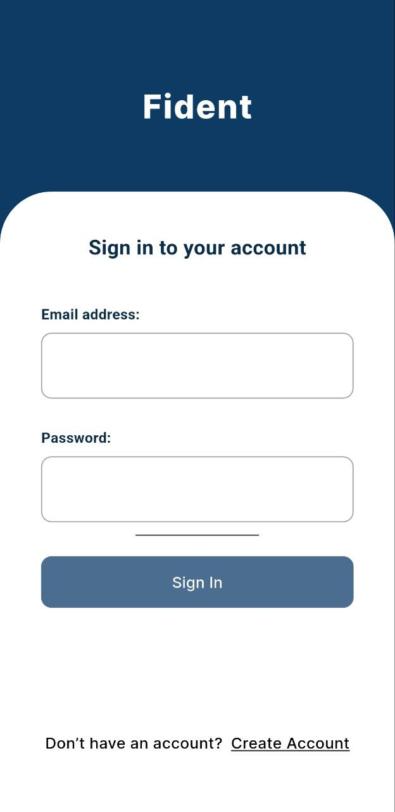
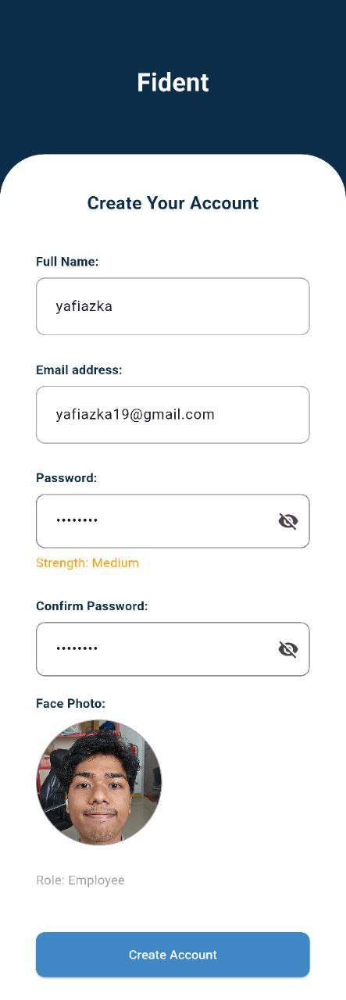
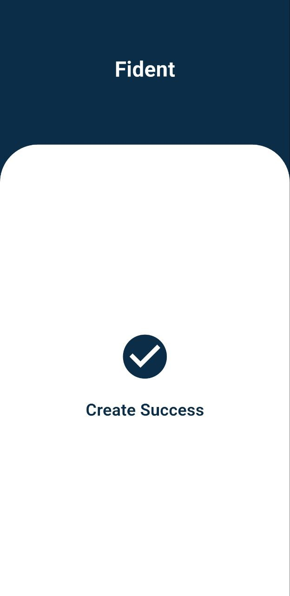
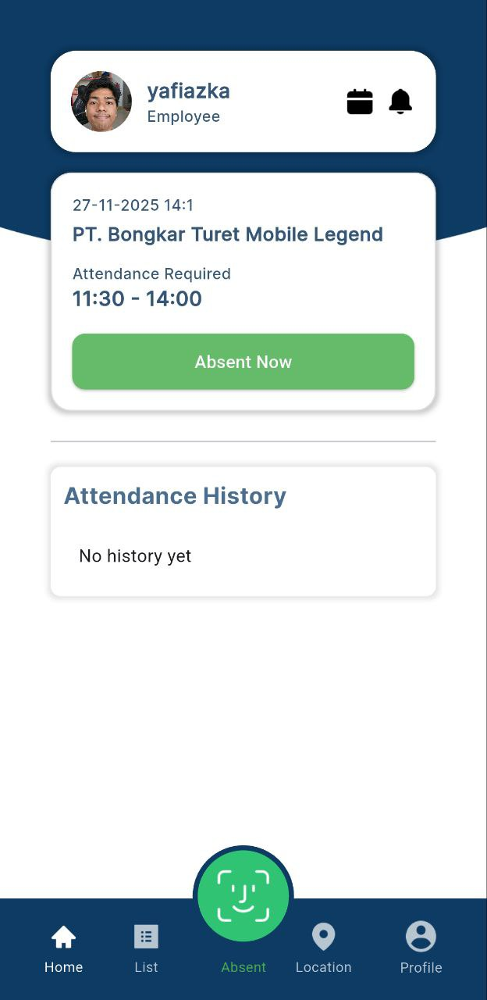
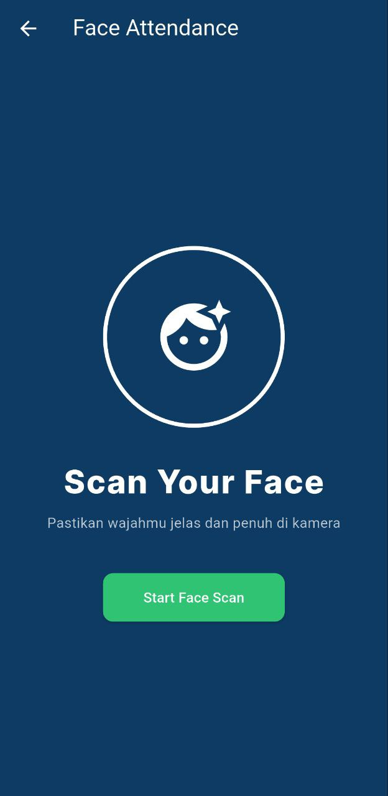
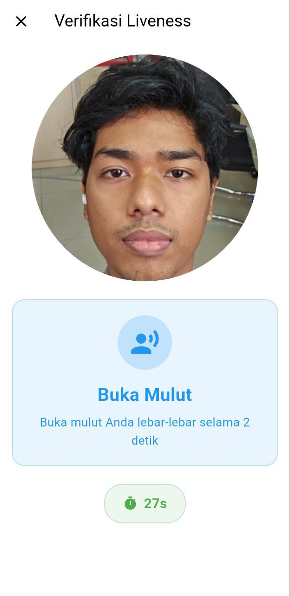
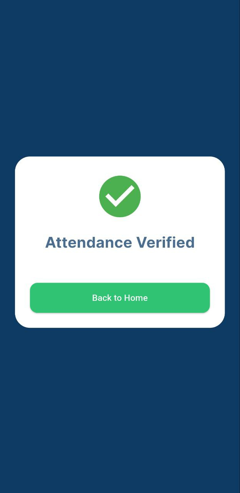
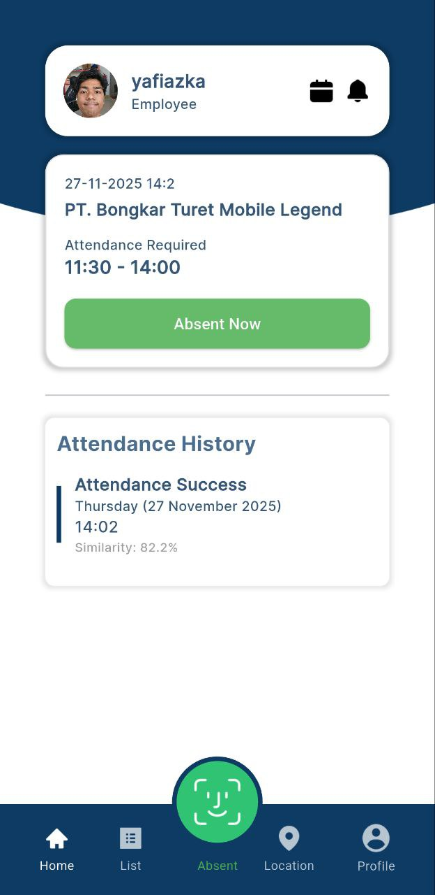
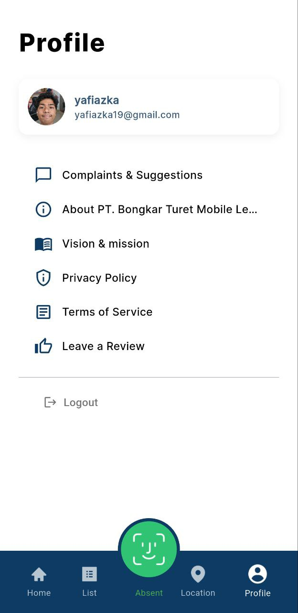
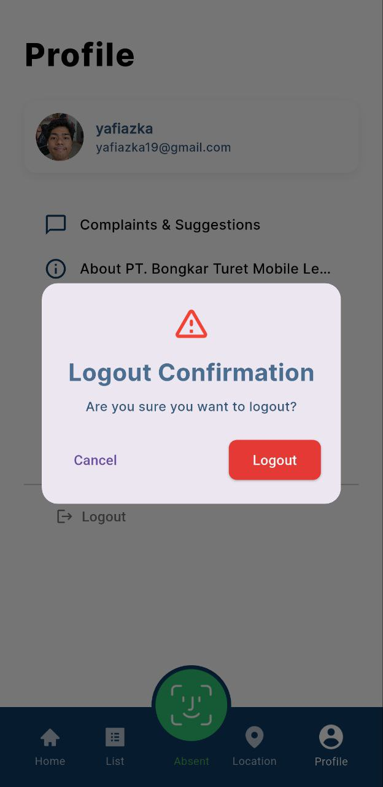

# Fident – Face Attendance Application

Fident adalah aplikasi **attendance berbasis pengenalan wajah** (Face Recognition + Liveness Detection) yang dibangun menggunakan **Flutter**, **Firebase**, dan **Face Match Liveness**.  
Aplikasi ini memastikan kehadiran karyawan lebih **aman, akurat, dan real-time** tanpa GPS.

---

## Team

| Name               | NIM        | Type      | Role                |
|--------------------|------------|-----------|---------------------|
| M Yafi Azka        | 24210003   | Core Team | Head of Engineering |
| Muhammad Alfarizi  | 24210007   | Core Team | UI/UX Designer      |
| M Nazar Qurrahman  | 24210035   | Core Team | AI Engineer         |
| Rivaldo Ten        | 24210037   | Core Team | IT Support          |

> This project was developed as part of a campus academic project by the core team members listed above.


##  Features

-  Authentication (Login & Register)
-  Face Registration
-  Face Matching + Liveness Detection
-  Attendance Verification
-  Real-time Attendance History
-  Profile & Session Management
-  Secure Logout

---

##  Application Flow

### ️Login

Pengguna login menggunakan email dan password yang telah terdaftar.



---

### Register

Jika belum memiliki akun, pengguna dapat melakukan pendaftaran.  
Pada tahap ini data dasar pengguna disimpan ke Firebase.



---

### Register Success / Login Success

Setelah register atau login berhasil, pengguna akan diarahkan ke halaman sukses sebelum masuk ke aplikasi utama.



---

### Home Page

Halaman utama menampilkan:
- Informasi pengguna
- Jadwal kehadiran
- Tombol **Absent Now**
- Riwayat kehadiran terakhir



---

### Face Attendance (Scan Face)

Pengguna menekan tombol **Absent Now**, lalu sistem akan:
1. Mengaktifkan kamera
2. Melakukan **Liveness Detection**
3. Membandingkan wajah dengan data referensi



---

### Liveness Verification

Sistem memastikan wajah yang dipindai adalah wajah asli (bukan foto/video).



---

### Attendance Verified

Jika wajah cocok (similarity ≥ threshold), absensi berhasil.



---

### Home After Attendance

Setelah berhasil absensi:
- Status kehadiran diperbarui
- Riwayat attendance muncul secara real-time



---

### Profile Page

Pengguna dapat melihat:
- Foto profil
- Email & role
- Menu informasi aplikasi



---

### Logout

Pengguna dapat logout dengan konfirmasi untuk mengakhiri sesi dengan aman.



---

## Tech Stack

- **Flutter**
- **Firebase Authentication**
- **Cloud Firestore**
- **GetX (State Management & Routing)**
- **Face Match Liveness**
- **Camera & Image Picker**

---

## Security Notes

- Face data digunakan hanya untuk verifikasi kehadiran
- Liveness Detection mencegah spoofing
- Session disimpan secara aman dan dihapus saat logout

---

## Getting Started

```bash
flutter pub get
flutter run
